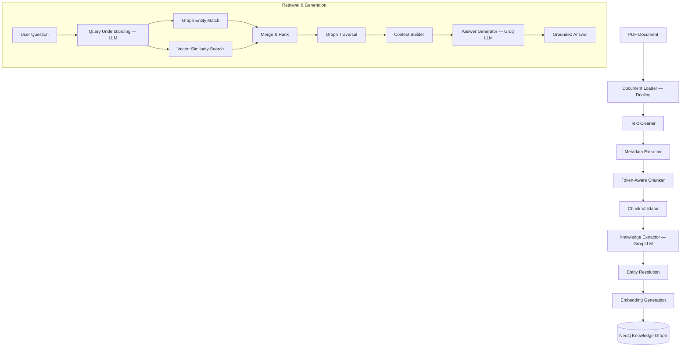

# Pure GraphRAG Pipeline

A production-grade Python implementation of a **Pure GraphRAG** (Graph Retrieval-Augmented Generation) system with **hybrid retrieval** (graph-structural matching + vector similarity search). Built on **Neo4j**, **Groq LLM**, and **sentence-transformers** embeddings.

---

## 🛠️ System Architecture



---

### 1. Document Ingestion (`ingestion/`)
- **`models.py`**: Pipeline-wide Pydantic v2 models — `DocumentMetadata`, `TextChunk`, `Entity`, `Relationship`, `ChunkExtraction`, `GraphData`.
- **`loader.py`**: Parses PDFs using **Docling** (`DocumentConverter`), computes SHA-256 file hash, extracts document metadata.
- **`cleaner.py`**: Unicode normalisation, control char removal, broken hyphenation fix, header/footer removal, whitespace collapse. Preserves entity casing.
- **`metadata.py`**: Enriches metadata — infers title from first line, estimates word count.
- **`chunker.py`**: Sentence-boundary aware chunking with token counting (tiktoken). Deterministic `chunk_id = {file_hash}_{index}`. Tracks `start_char`/`end_char` offsets.
- **`validator.py`**: Filters chunks below 20 tokens and boilerplate (TOC, reference lists).

### 2. Knowledge Extraction (`extraction/`)
- **`prompts.py`**: Prompt-builder functions for entity/relationship extraction, query understanding, and answer generation.
- **`extractor.py`**: 6-step pipeline — per-chunk LLM extraction → global entity resolution (name normalisation, alias merging, type conflict resolution) → relationship resolution → embedding generation → validation → serialisation to `output/graph_data.json`.

### 3. Graph Construction (`graph/`)
- **`schema.py`**: Node labels (`Chunk`, `Entity`), entity type vocabulary, structural relationships (`EXTRACTED_FROM`, `NEXT_CHUNK`), relationship label sanitiser.
- **`neo4j_client.py`**: Connection manager with batch writes (`UNWIND`), vector index creation (`db.index.vector.queryNodes`), and context-manager support.
- **`builder.py`**: Batch creates Chunk nodes, Entity nodes (with float-list embeddings), dynamic inter-entity relationships, `EXTRACTED_FROM` provenance links, and `NEXT_CHUNK` sequential links.

### 4. LLM Layer (`llm/`)
- **`generator.py`**: `LLMClient` (Groq OpenAI-compatible wrapper with `tenacity` retry + JSON generation) and `EmbeddingModel` (sentence-transformers `all-MiniLM-L6-v2` with batch encoding).

### 5. Retrieval & Generation (`retrieval/`)
- **`graph_search.py`**: Hybrid search — graph-structural matching (exact + alias + fuzzy keyword Cypher) combined with vector similarity search. Combined scoring: `graph × 0.6 + vector × 0.4`. 1-hop neighbour traversal + `NEXT_CHUNK` expansion.
- **`context_builder.py`**: Token-budgeted context assembly (entities → relationships → chunk text). Fills within a 4000-token budget using tiktoken.

### 6. Shared Infrastructure
- **`exceptions.py`**: Typed exception hierarchy — `GraphRAGError`, `DocumentLoadError`, `LLMGenerationError`, `LLMJsonParseError`, `GraphConstructionError`, `EntityResolutionError`, `RetrievalError`.

---

## 🚀 Getting Started

### 📋 Prerequisites
- **Python 3.10+**
- **Neo4j 5.11+** (required for vector index support)
- **Groq API Key**

### 📦 Installation
1. Clone the repository and navigate to the project directory:
   ```bash
   cd graph_rag
   ```
2. Install dependencies:
   ```bash
   pip install -r requirements.txt
   ```
3. Set up your environment variables in `.env`:
   ```ini
   GROQ_API_KEY=gsk_your_key_here
   NEO4J_URI=bolt://localhost:7687
   NEO4J_USERNAME=neo4j
   NEO4J_PASSWORD=your_password
   NEO4J_DATABASE=neo4j
   EMBEDDING_MODEL_NAME=all-MiniLM-L6-v2
   EMBEDDING_DIMENSION=384
   ```

---

## 🖥️ Usage

### A. Ingest a Document
Processes the PDF → builds the knowledge graph in Neo4j:
```bash
python app.py ingest data/scraper.pdf
```

### B. Single Query
Ask a question and get a grounded answer:
```bash
python app.py query "What is web scraping?"
```

### C. Interactive Q&A
Start an interactive terminal session:
```bash
python app.py qa
```

---

## 📊 Neo4j Graph Model

```
Nodes:
  (:Chunk {chunk_id, text, token_count, chunk_index, source_file, summary})
  (:Entity {name, type, description, aliases, embedding})

Edges:
  (:Entity)-[:EXTRACTED_FROM]->(:Chunk)
  (:Chunk)-[:NEXT_CHUNK]->(:Chunk)
  (:Entity)-[:DYNAMIC_TYPE {description, weight, source_chunk_ids}]->(:Entity)

Indexes:
  UNIQUE CONSTRAINT on Entity.name
  INDEX on Entity.type
  INDEX on Chunk.chunk_id
  VECTOR INDEX on Entity.embedding (cosine, 384-dim)
```

---

## 🔍 Verification

### Neo4j Browser Checks
```cypher
MATCH (e:Entity) RETURN count(e);
MATCH ()-[r]->() RETURN count(r);
MATCH (e:Entity) WHERE e.embedding IS NOT NULL RETURN count(e);
SHOW INDEXES;
```

### Vector Search Test
```cypher
CALL db.index.vector.queryNodes('entity_embedding_index', 5, $embedding)
YIELD node, score RETURN node.name, score;
```
